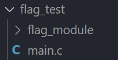

# LOG_MODULE

This project is a library (flag_module.h file with the extra layer usr_flags.h file) which helps to generate flags of 1 bit size.

The project purpose is to facilitate the creation of flags with a 1 bit size, because in some cases, such as in the embedded systems, resources are more limited. Therefore, you have to take care of this aspect. If you are going to use flags in your project, this library can help you to save some memory.
 
## Usage example

The first thing that you need to do is map your flags in the extra layer usr_flags.h (you can create your own .h file based on the structure of the usr_flags.h file and add it to the project build)

The following code is an example of what the extra layer file should look like:

```
#ifndef _USR_FLAGS_
#define _USR_FLAGS_

#include "flag_module.h"

#define myFlag FLAG_0
#define ursFlag FLAG_1
#define nameFlag FLAG_2

#endif //_USR_FLAGS_
```
In the example above we specify that the original "FLAG_0" name is going to be renamed "myFlag", or on the other words, we linked the "FLAG_0" MACRO with myFlag MACRO.

After the user flag mapping, you can add the extra layer to your main project.

An example of a main code is shown as follows:

```
#include "stdio.h"
#include "usr_flags.h"

CREATE_FLAGS();

int main(int argc, char const *argv[])
{
   ursFlag = 1;
   printf("ursFlag: %d\n", ursFlag);

   ursFlag = 0;
   printf("ursFlag: %d\n", ursFlag);

   myFlag = 1;
   printf("myFlag: %d\n", myFlag);

   myFlag = 0;
   printf("myFlag: %d\n", myFlag);


   return 0;
}
```
   
1. Create the flags
   ```
   CREATE_FLAGS();
   ```

2. Set any value to your flag
   ```
   ursFlag = 1;
   ```
3. Use your flag (you can print the flag value or you can validate the status)
   ```
   printf("ursFlag: %d\n", ursFlag);
   ```

**Example output:**
```
ursFlag: 0
ursFlag: 1
myFlag: 1
myFlag: 0
```

## Compilation
First you have to download the library (or you can clone or add to your project as a submodule). 
The library location in your workspace should look as follows:



Then, the next step for compilation it can be realized using the next gcc command on the terminal:

```
gcc -g main.c -I flag_module -o main.exe 
```

## Execution
To excecute the main.exe file you can use the next command:
```
./main.exe
```

## Message
I hope you enjoy this code, I know there are many ways to make a 1-bit flag (such as using bitwise operations) but I consider this to be a more user-friendly way to create and manage 1-bit flags. 

On the other hand, you can use this library with different source codes, such as other libraries in a simultaneous way. 

And remember, use

👍"Hello Dog! 🐶"

Instead of

✖️"Hello World!"


